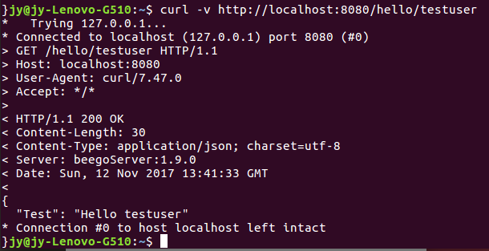
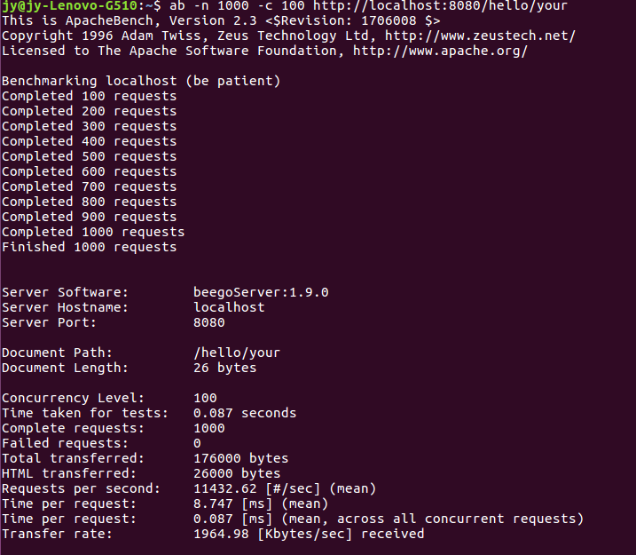
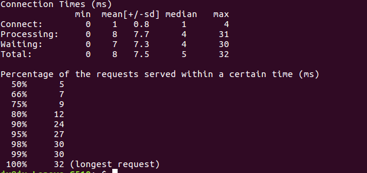

 [TOC]
#### 开发web服务程序
1.这次是编程实现一个web服务程序类似cloudgo应用
(1)使用了beego这个框架,决策的依据,还是简单好用吧
(2)关键的代码如下所示
default.go文件
```
package controllers

import (
	"github.com/astaxie/beego"
)

type MainController struct {
	beego.Controller
}

//set a new controller
type FileController struct {
	beego.Controller
}

type hello struct {
	id string
}

func (this *FileController) Get() {
	//get the value testuser
	a := this.Ctx.Input.Param(":id")
	//set the json data
	this.Data["json"] = map[string]interface{}{"Test": "Hello " + a}
	this.ServeJSON()
}

func (c *MainController) Get() {
	a := c.Ctx.Input.Param(":id")
	c.Ctx.WriteString("hello " + a)
}
```
router.go文件
```
package routers

import (
	"github.com/astaxie/beego"
	"hello/controllers"
)

func init() {
	//set the route path and choose the handler
	beego.Router("/hello/:id", &controllers.FileController{})
}
```
2.使用curl测试
测试结果如下所示

3.使用ab测试
测试结果


其中测试命令的-n表示执行的请求数量,-c表示并发请求个数
测试结果中
Document Path  请求的资源
Document Length  文档返回的长度,不包括相应头
Concurrency Level  并发个数
Time taken for tests  总请求数
Failed requests 失败的请求数
Requests per second  平均每秒的请求数
Time per request  平均每个请求消耗的时间
Time per request  上面的请求除以并发数
Transfer rate  传输速率
50%  7778 表示50%的请求都在7778Ms内完成
